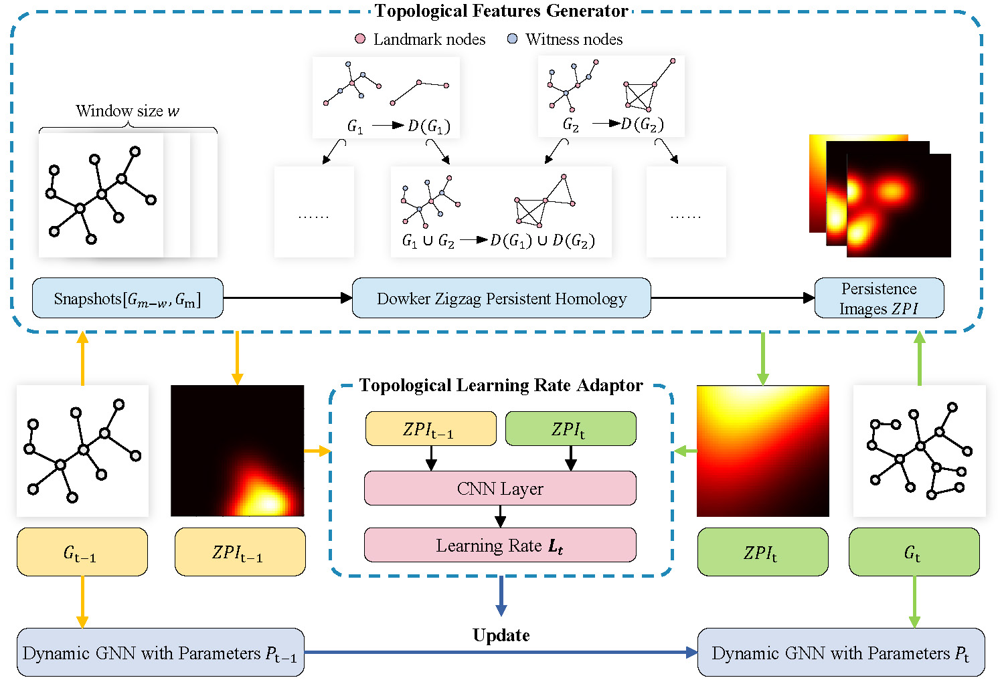

# TMetaNet

## Overview
This repository contains the implementation of the paper: TMetaNet: Topological Meta-Learning Framework for Dynamic Link Prediction.


### Code References
We have referenced and adapted code from the following repositories:
1. WinGNN
   - Link: https://github.com/pursuecong/WinGNN
   - Reference: You J, Du T, Leskovec J. ROLAND: graph learning framework for dynamic graphs[C]//Proceedings of the 28th ACM SIGKDD conference on knowledge discovery and data mining. 2022: 2358-2366.
2. Roland
   - Link: https://github.com/snap-stanford/roland
   - Reference: Zhu Y, Cong F, Zhang D, et al. WinGNN: dynamic graph neural networks with random gradient aggregation window[C]//Proceedings of the 29th ACM SIGKDD conference on knowledge discovery and data mining. 2023: 3650-3662.


## Project Structure
```bash
project-root/
├── config/ # Configuration files
├── dataset/ # Datasets or preprocessed inputs
├── exp_scripts/ # Experiment scripts, results and logs 
├── model/ # Model architectures
├── utils/ # Utility functions
├── topo_utils/ # Utility functions of topological data analysis
├── main.py # Entry point for training/testing
├── example.yaml # Example configuration file
├── requirements.txt # Python dependencies
├── README.md # This file
```

## Installation
- Python 3.9+
```bash
git clone https://github.com/your-username/your-project.git
cd your-project
pip install -r requirements.txt
```

## Quick Start

### Prepare the dataset
```bash
cd preprocess
python preprocess.py
```
你需要在preprocess.py中设置数据集的名称，并运行脚本。

### 运行程序
```bash
cd ..
python main.py --config config/config.yaml
```


## Citation
If you use TMetaNet in your research, please cite our paper:
```
@article{tmetanet2024,
  title={TMetaNet: Your Paper Title},
  author={Author Names},
  journal={Journal Name},
  year={2024}
}
```